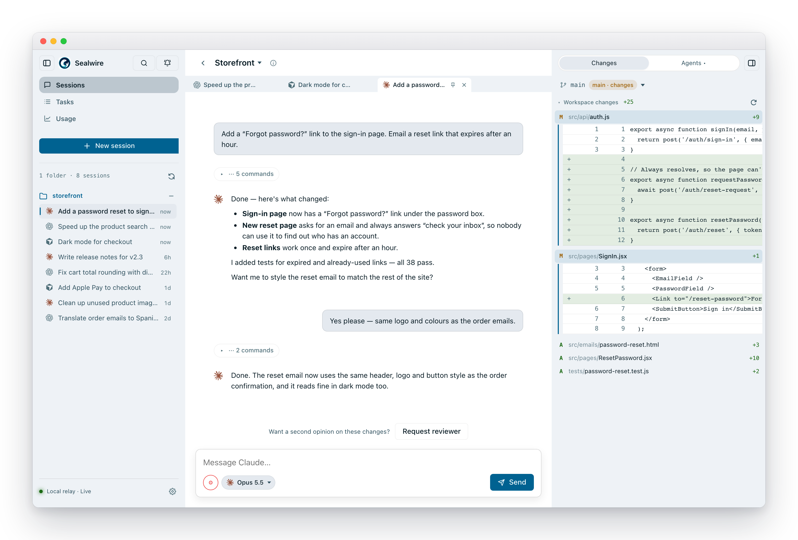
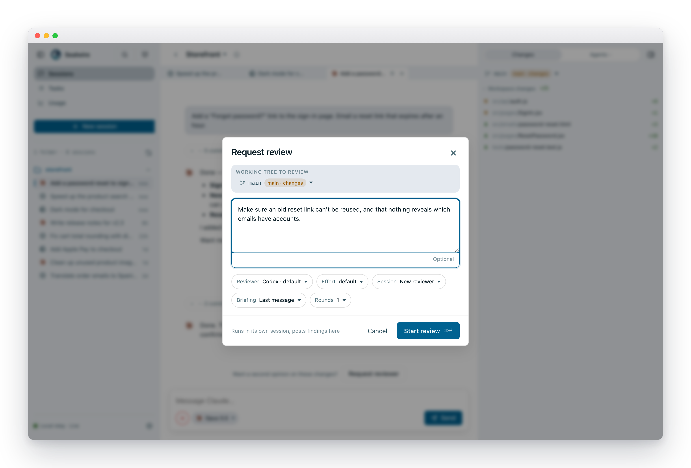
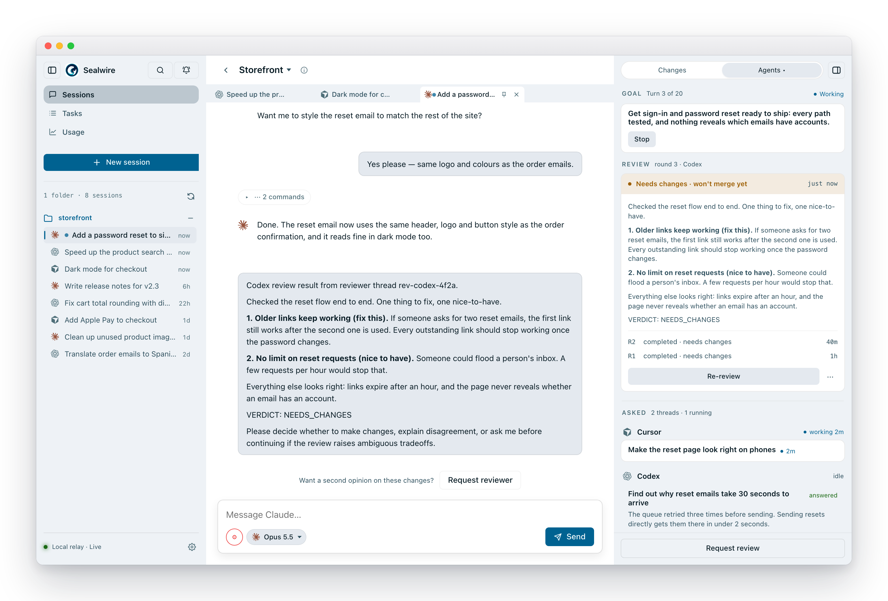
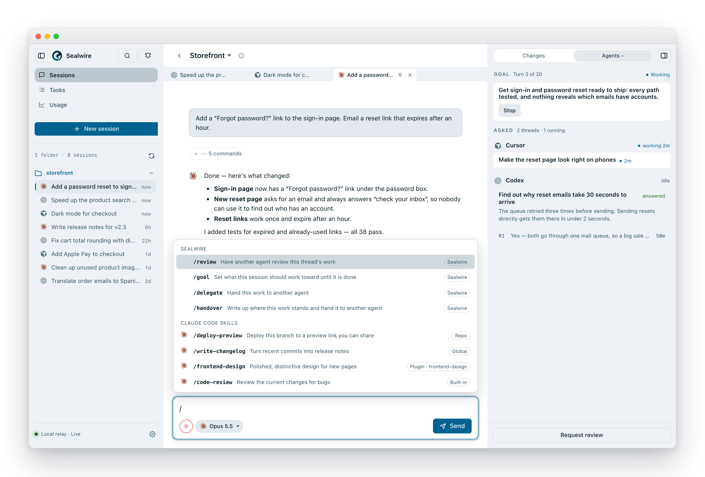
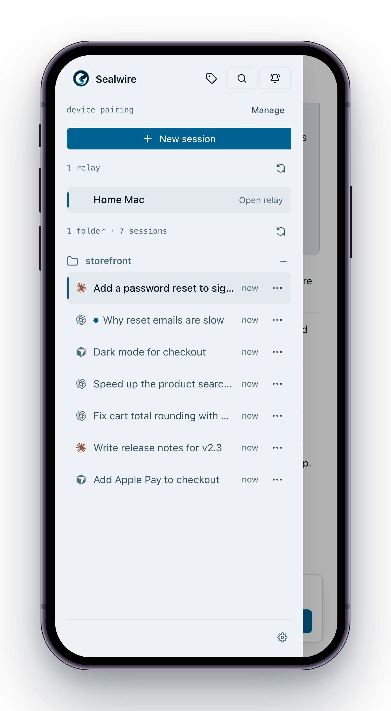
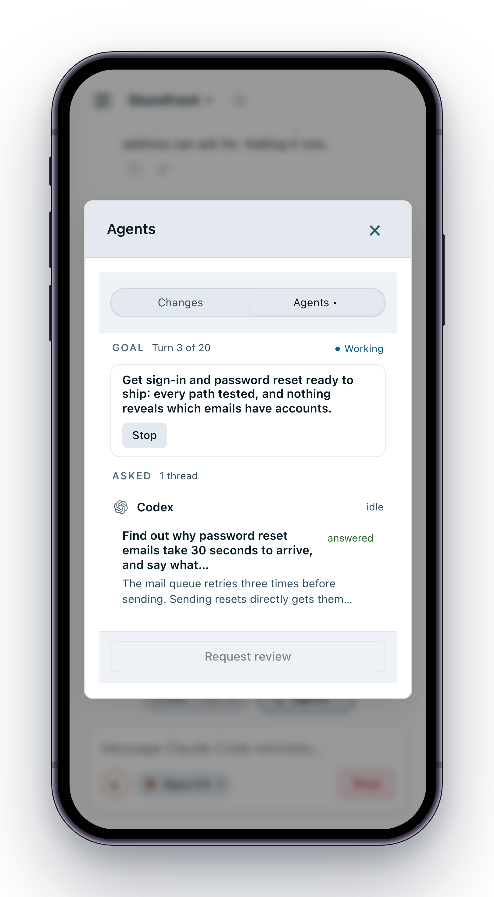

<p align="center">
  
</p>

<h1 align="center">Sealwire</h1>

<p align="center">
  <a href="https://www.npmjs.com/package/sealwire">
    
  </a>
  <a href="https://github.com/sealwire/sealwire/stargazers">
    
  </a>
  <a href="LICENSE">
    
  </a>
</p>

<p align="center">
  <strong>English</strong> · <a href="./README.zh-CN.md">中文</a>
</p>

<p align="center">Your coding agents, working together on your own machine — and in your pocket wherever you go.</p>

<p align="center">
  
</p>

Sealwire puts Claude Code, Codex and Cursor behind one simple screen. Start
work at your desk, check on it from your phone, approve the next step from the
couch. The agents run on your computer, next to your code — Sealwire itself never
sees it.

- **All your agents in one place.** Claude Code, Codex and Cursor side by side,
  in the same window, with the same controls. Use whichever one you like for
  each job, or switch mid-project.
- **Agents that check each other's work.** Ask a *different* agent to review
  what was just written — Claude reviews Codex, Codex reviews Claude — and let
  them go back and forth until the reviewer is happy.
- **Agents that work as a team.** Set a goal and let an agent run until it's
  done, pass a side job to another agent, or hand the whole thing over — each
  one a single slash command.
- **Pick up anywhere.** The same session follows you from laptop to browser to
  phone. You get a notification when an agent needs you, and can approve it
  right there.
- **Private by default.** Sealwire has no copy of your code or your
  conversations. When your phone connects from outside, everything is end-to-end encrypted — even the server
  in the middle can't read it.
- **Free on your own machine.** No account and nothing to deploy — one command
  and you're running. Reaching it from your phone goes through SealWire Cloud,
  which needs an access key.

## Get started

You need at least one of these installed and logged in:

- **[Claude Code](https://docs.anthropic.com/en/docs/claude-code)** — a Claude
  login or an `ANTHROPIC_API_KEY`. Everything else it needs comes bundled.
- **[Codex](https://github.com/openai/codex)** — the `codex` command-line tool.
- **[Cursor](https://cursor.com/cli)** — the `cursor-agent` command-line tool.

Then, in the folder you want to work on:

```bash
npx sealwire
```

Sealwire opens in your browser at <http://localhost:8787>. It only listens on
your own machine until you decide otherwise.

**Tip:** run it on a computer that's always on — a desktop, a home server — and
long jobs keep going even with your laptop closed.

### Connect your phone

```bash
npx sealwire cloud
```

The first time, it asks for your SealWire Cloud access key. Then scan the QR
code with your phone and the same sessions show up there. Add
it to your home screen and it works like an app, notifications included.

## Let agents review each other

One model checking its own homework isn't much of a check. In Sealwire, review
is one click: pick who should review, which model, and how many rounds of back
and forth you'll allow.

<p align="center">
  
</p>

The reviewer works in its own session, looks at the actual changes, and posts
its findings — and a clear verdict — back into your conversation. Allow more
than one round and the two agents keep going until the reviewer approves.

<p align="center">
  
</p>

## Four commands that do the heavy lifting

Type `/` in the message box. Each command reads plain words for who and how
— `codex`, `opus 5`, `high` — and whatever you write after that is the
instruction.

<p align="center">
  
</p>

| Command | What it does |
|---|---|
| `/goal` | Give the agent a finish line and let it keep going on its own until it gets there. It stops only to say *done* (with proof), *stuck* (and why), or *I need you to decide something*. |
| `/review` | Have a different agent check the work so far. `/review codex high focus on the error paths` |
| `/delegate` | Pass a side job to another agent and get the answer back — say, Codex chases a flaky test while Claude keeps going. Both conversations stay open, so you can read along or step in. |
| `/handover` | The current agent writes up where things stand and hands the whole job to another one to finish. Handy when you've run out of quota, or want a fresh pair of eyes. |

With `/delegate` and `/handover` you can also type `@` to pick a session that's
already open, instead of starting a fresh one. Your agents' own commands and
skills show up in the same menu, right beside these.

## Stay in control from anywhere

Long work shouldn't need you at your desk. Every session is on your phone —
which agent is on what, which goal is still running and how far along it is,
and what the agents you brought in came back with.

<p align="center">
  
  &nbsp;&nbsp;
  
</p>

When an agent wants to run a command or change something important, you see
exactly what it's asking for and approve or deny it right there. Push
notifications tell you when a session needs you, finishes, or runs into trouble,
and **Take over** moves control to the device in your hand.

## And a lot more

- **Projects and worktrees** — sessions grouped by repo and branch, with a
  panel showing exactly what changed.
- **Tabs and pins** — keep several sessions open side by side.
- **Fork a conversation** from any message to try another idea without losing
  the original — even into a different folder.
- **Search and a notification bell** across every session, so an agent that
  needs you in the background never gets lost.
- **Approval modes** per session, from "ask me about everything" to "just go".
- **Desktop app for macOS** (preview), with a menu-bar icon.

## Commands

```bash
npx sealwire                 # start on this machine only, and open the browser
npx sealwire cloud           # also let your phone connect from anywhere (access key)
npx sealwire local           # guarantee it never talks to the internet
npx sealwire --port 8788     # use a different port
npx sealwire --no-open       # don't open a browser
npx sealwire --beta          # try features still in development (Tasks, Usage)
npx sealwire --help          # everything else
```

Features still in development show up as a blurred preview until you turn them
on with `--beta`. Prefer to run your own connection server instead of Sealwire
Cloud? Point `--broker` at a self-hosted one.

## What's coming

- **Tasks and task teams** — give Sealwire a goal, and a coordinator agent
  plans it, splits it across several agents, and has their work reviewed before
  it lands. You approve the plan; it does the rest. Try it early with `--beta`.
- **Usage and cost** — how many tokens, and how much money, each agent and
  project is using, week by week. Also behind `--beta`.
- More agents beyond Claude Code, Codex and Cursor.
- A native mobile app, where the web version hits its limits.

## Security

Private mode is the default: anything that travels between your devices is
end-to-end encrypted, and the connection server only ever passes along data it
can't read. The details are in [`docs/security-model.md`](docs/security-model.md).

## Development

Sealwire is a Rust server, a small Node worker for Claude Code, and a Vite web
app. [`AGENTS.md`](AGENTS.md) has the code map and the checks to run after a
change, and [`docs/testing-matrix.md`](docs/testing-matrix.md) explains what
each test suite covers.

```bash
cargo test -p relay-server
node --test claude-worker/*.test.mjs
npm test
```

## License

Source-available under the Elastic License 2.0. See [`LICENSE`](LICENSE).

## Contributions

By submitting a contribution you agree to the terms in
[`CONTRIBUTING.md`](CONTRIBUTING.md), including a broad license that allows the
maintainer to relicense contributions in the future.
